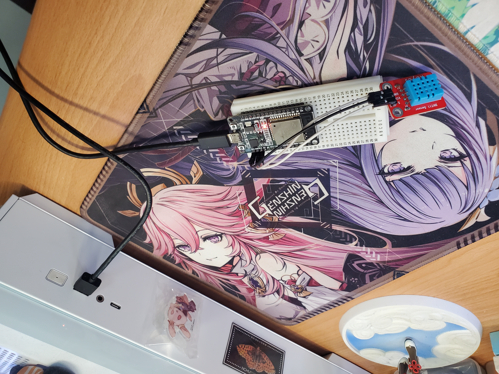
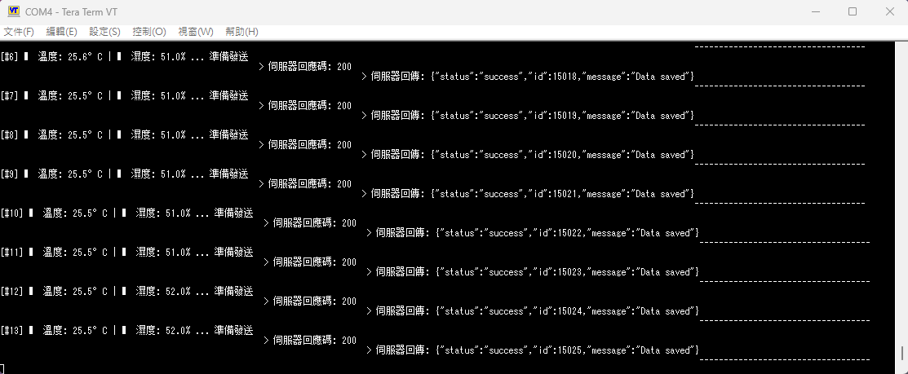
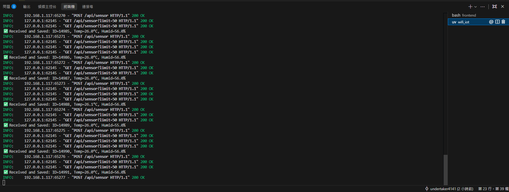
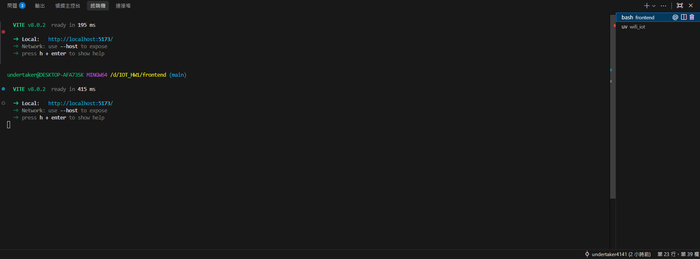
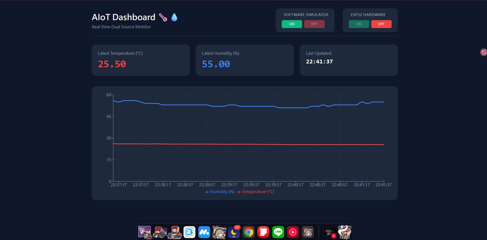
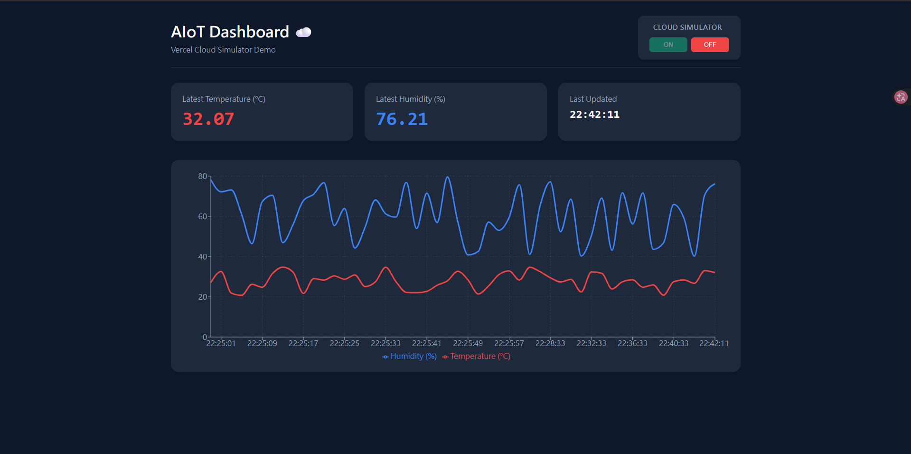

# HW1 AIoT 系統實作專題報告：雙軌架構下之邊緣端感測與雲端展示系統

---

## 🔗 專案資源連結 (Project Links)

- **GitHub Repository**: [https://github.com/undertaker4141/IOT_HW1](https://github.com/undertaker4141/IOT_HW1)
- **Vercel Live Demo**: [https://iot-hw-1.vercel.app/](https://iot-hw-1.vercel.app/)
- **實機展演動態影片(Demo Video)**: [https://youtu.be/\_8iFi2bmKJ0](https://youtu.be/_8iFi2bmKJ0)

---

## 摘要 (Abstract)

本專題旨在實作一套完整的邊緣運算與物聯網 (AIoT) 系統，涵蓋硬體感測器擷取、無線網路傳輸、後端資料存儲以及現代化前端資料視覺化。為解決「實機地端閉門展示」與「雲端公開無後端展示 (Live Demo)」之間的環境衝突，本專案首創提出並採用 **「雙軌獨立法 (Dual-Track Approach)」** 分支架構。透過 ESP32 開發板與 FastAPI 建構高可靠之本地物聯網連線，同時以去耦合之純前端 React 技術部署於 Vercel 實現無氣候環境限制的雲端模擬器。本報告將詳細論述軟硬體架構、通訊設計以及實驗數據成果。

---

## 1. 系統架構設計 (System Architecture)

為了同時滿足實機通訊驗證與 Vercel 線上 Live Demo 之標準，本系統架構在物理與邏輯上切分為兩條獨立軌道：

### 1.1 地端真實硬體軌道 (Local Hardware Track)

負責呈現端到端 (End-to-End) 的真實物聯網協定實作。

- **Edge 端 (前端硬體)**：使用 ESP32 WROOM-32 (`denky32`) 開發板，並於 GPIO 15 介接 DHT11 溫濕度感測器。ESP32 透過連接智慧型手機之 WiFi 熱點，建立與後端同網段的 TCP/IP 連線。
- **Backend 端 (後端伺服器與資料庫)**：使用 Python 3.12 搭配 FastAPI 框架建立非同步 RESTful API。資料持久層使用內建的輕量級關聯式資料庫 `SQLite` (`aiotdb.db`)。
- **Frontend 端 (本地儀表板)**：基於 React.js 與 Vite 建立，以 `fetch` API 每兩秒定期對 FastAPI 伺服器進行輪詢 (Polling)，取得即時感測紀錄並利用 `Recharts` 繪製動態折線圖。

### 1.2 雲端模擬展示軌道 (Cloud Simulator Track)

解決雲端佈署時失去地端 SQLite 狀態的問題，負責提供順暢的雲端展示體驗。

- **Vercel 部署**：將原本的 React 前端直接移除 API 依賴。利用瀏覽器端的 JavaScript 執行緒 (透過 `useEffect` 與 `setInterval`) 每 2 秒於背景安全地產生 20°C~35°C 之間、濕度 40%~80% 之亂數模擬數據，成為一個自我驅動 (Self-driven) 的動態儀表板。

---

## 2. 實作方法與通訊協定 (Implementation Methodology)

### 2.1 邊緣端硬體採樣與發送

開發環境使用 PlatformIO。ESP32 感測器循環境限制，設定 DHT11 的安全採樣頻率為每 5000 毫秒一次。讀取成功後，透過 `HTTPClient` 函式庫，將浮點數溫度 (Temperature) 與濕度 (Humidity) 組裝成 JSON 結構（例如 `{"temp": 24.5, "humid": 60.1}`），以 HTTP `POST` 方法傳送至 FastAPI 指定的 `/api/sensor` 路由。

### 2.2 後端中樞資料處理

FastAPI 接收到 POST 請求後，透過 Pydantic 模型檢驗 JSON 資料正確性。確認無誤後，即時產生 SQL 語法寫入 `sensor_data` 資料表。其欄位包含具備自增主鍵之 `id`、`temp`、`humid`，以及由 SQLite `datetime('now', 'localtime')` 自動生成的硬體上傳時間戳記，確保每筆紀錄的時間同步性。

### 2.3 前沿監控介面設計

無論地端或雲端的儀表板，皆採用自適應 (Responsive) 版面設計。設計元件涵蓋：最新數據獨立燈號顯示面板、更新時間紀錄格式轉換、以及具備格線與 Legend 的客製化動態折線圖。介面中亦具備「運作狀態指示燈」，明確標示當下驅動圖表的來源為 Hardware 或 Simulator。

---

## 3. 實驗結果與火力展示 (Results & Demonstrations)

本節將列舉由真實物理環境中側錄的終端數據、影像以及對應之軟體介面截圖，以驗證系統穩定性。

### 3.1 實機硬體與通訊驗證

> **ESP32 實機佈線與感測器連接狀態：**  
> 開發板成功供電並與 DHT11 模組建立單總線 (Single-bus) 讀取連線。
>
> 

> **UART 序列埠通訊輸出：**  
> 透過 115200 Baud Rate 監控，可確認 ESP32 成功獲取 IP 位址，並成功封裝 JSON 返回 HTTP 200 OK 成功碼。
>
> 

### 3.2 伺服器與地端前端運作狀態

> **後端 (Backend) 行為驗證：**  
> FastAPI (Uvicorn) 大量接收來自本地網路 (例如 192.168.x.x) 的 Socket 連線，並確認成功寫入資料。
>
> 

> **前端 (Frontend) npm 執行緒狀態：**  
> 本地 Vite 伺服器成功啟動並負責熱重載網頁與發起 API Request。
>
> 

> **本地版 React 儀表板全功能展示：**  
> 成功讀取 SQLite 本地資料庫歷史軌跡並繪製出精細折線與即時更新時間板。
>
> 

### 3.3 Vercel 雲端虛擬儀表板展示

> 雲端軌道 (Frontend Vercel 版) 移除了硬體 API 依賴後，完美且輕量化地自我驅動圖表，符合 Live Demo 之雲端網展要求。
>
> 

---

## 4. 結語 (Conclusion)

本專案圓滿達成了硬體感測採樣、關聯式資料庫設計以及現代網頁視覺化的跨界整合。其中「雙軌獨立法」不僅徹底根除了地端系統上雲時的無狀態 (Stateless) 連線痛點，還成功確保了硬體系統在展演時評分的絕對真實性。未來可考量引進 MQTT 取代 HTTP 以換取更低功耗傳輸，並進一步將 SQLite 轉移至 Supabase 達成資料持久層的全面雲端化。
